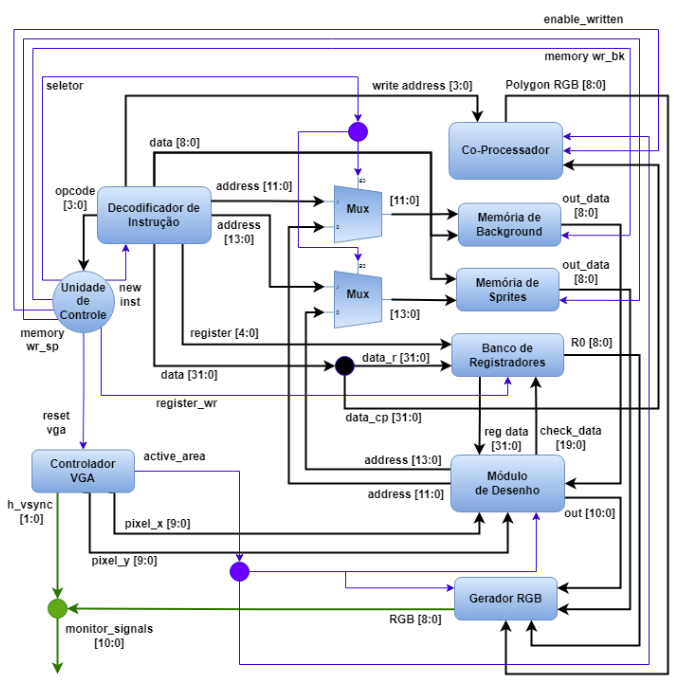
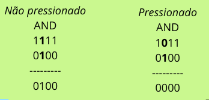
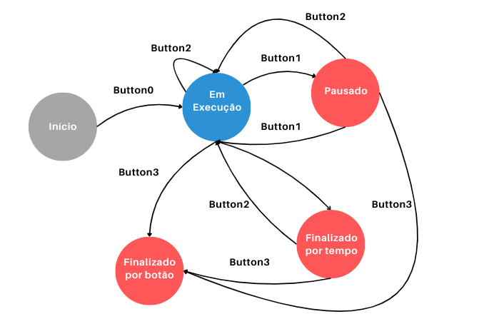
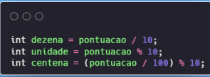
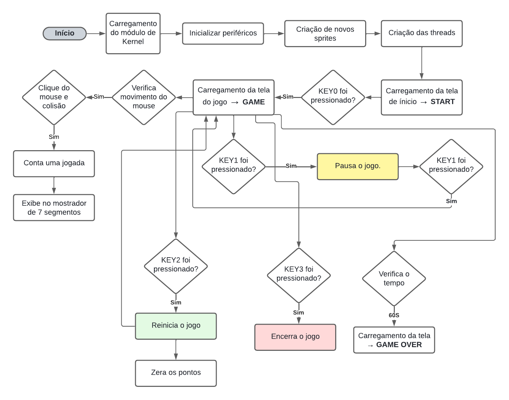
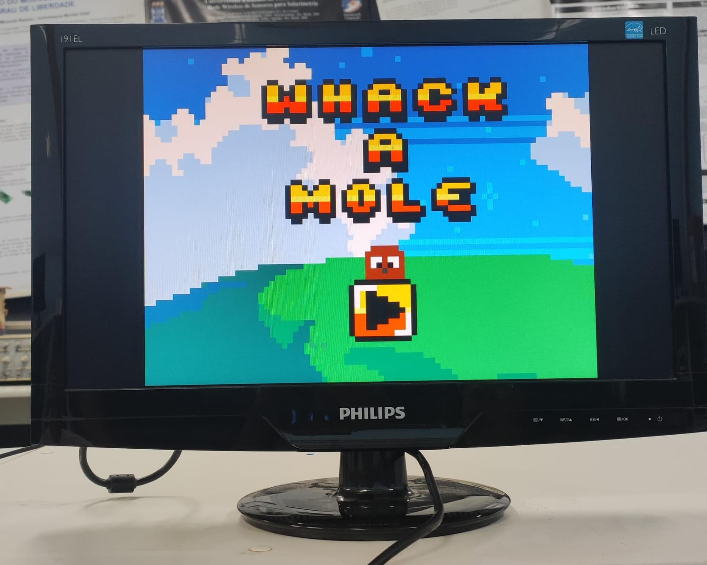
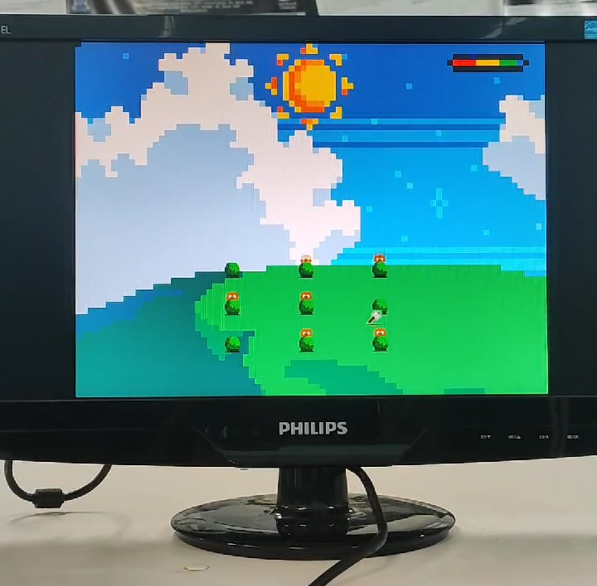
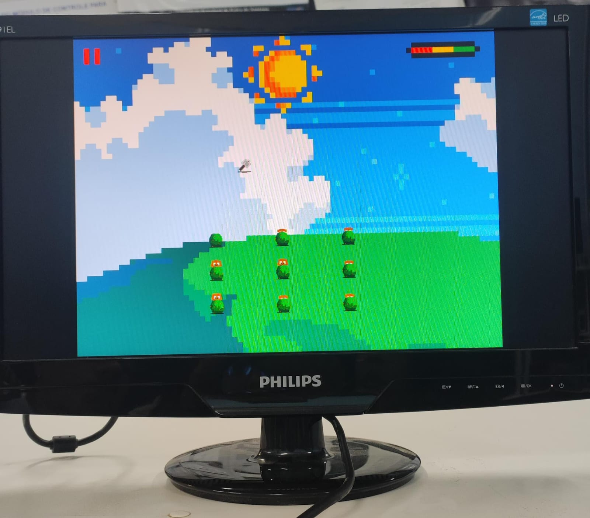
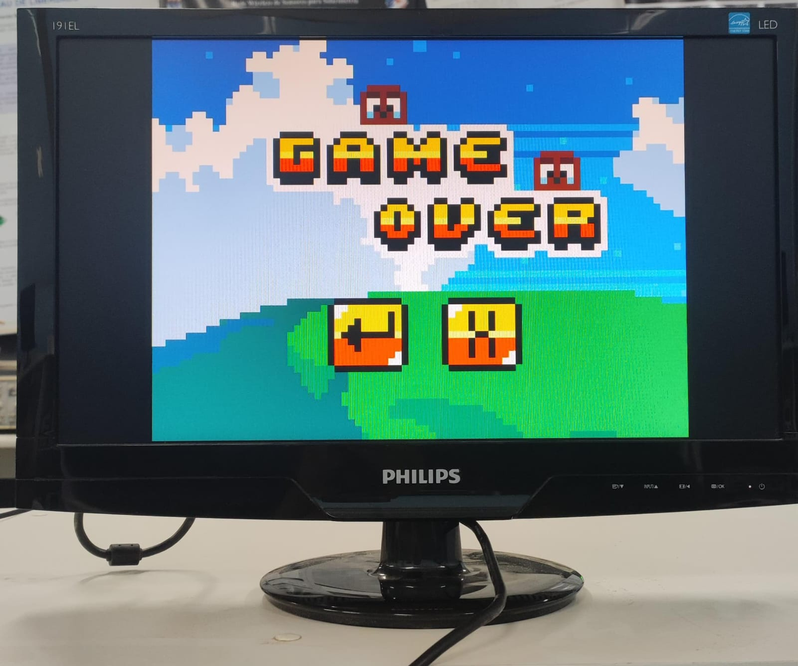

<h1 align="center"> Whack a Mole - Jogo 2D</h1>

## Sobre

<p align="justify"> 
O objetivo central deste projeto foi desenvolver um jogo para a arquitetura criada anteriormente no <a href=“https://github.com/vitoriatanan/Processador-Grafico/tree/main?tab=readme-ov-file#sobre“>projeto de comunicação com o processador gráfico</a>. 
<p>

<p align="justify">
Inspirado em um clássico arcade, o jogo simula o desafio de acertar o maior número possível de toupeiras que surgem aleatoriamente acima de arbustos na tela. O jogador deve usar um martelo controlado pelo mouse para acertar as toupeiras e acumular pontos dentro de um limite de tempo de 1 minuto.
<p>

<p align="justify">
O jogo foi projetado para permitir a interação do usuário exclusivamente através do mouse, que serve como um dos principais meios de controle. Para permitir o controle das diversas funcionalidades do jogo como iniciar, pausar, retornar e encerrar, foi necessário mapear e programar os botões da placa DE1-SoC. Além disso, foi implementado o uso de displays de 7 segmentos para fornecer informações ao usuário.
</p>

<p align="justify"> 
A plataforma DE1-SoC combina um processador ARM (HPS) com um processador gráfico integrado na FPGA, possibilitando uma comunicação eficiente entre esses dois componentes. Essa integração permite o controle e a manipulação visual através de um monitor VGA com resolução de 640×480 pixels.
</p>

<p align="justify"> 
Além disso, o projeto envolveu a otimização do módulo de Kernel Linux e da biblioteca em linguagem C para estabelecer uma ponte de comunicação mais eficiente entre o processador gráfico na FPGA e o programa a nível de usuário, para que fosse possível realizar com êxito a construção do projeto atual.
</p>


## Sumário
- [Softwares e Periféricos Utilizados](#softwares-e-periféricos-utilizados)
    - [Kit de desenvolvimento DE1 SoC](#kit-de-desenvolvimento-de1-soc)
    - [Linguagem C](#linguagem-c)
    - [Editor de Texto VSCode](#editor-de-texto-vscode)
    - [Compilador GCC](#compilador-gcc)
    - [Monitor Tubo CRT](#monitor-tubo-crt)
    - [Padrão VGA](#padrão-vga)
    - [Mouse]
    - [Processador Gráfico]
    - [Módulo de Kernel]


- [Uso de Threads]
    - Thread1 - Movimento do Martelo
    - Thread2 - Movimento das Toupeiras


- [Implementação do Jogo](#implementação-do-jogo)
    - Srites novas
    - Colisão 
    - [Movimentações (mouse e toupeiras)](#movimentações-mouse-e-toupeiras)
    - [Uso dos Botões](#uso-dos-botões)
    - [Display 7 Segmentos](#display-7-segmentos)
    - [Temporizador](#temporizador)
    - [Regras e Jogabilidade](#regras-e-jogabilidade)

- [Solução Geral]
- [Cenários de Testes](#cenários-de-testes)
- [Conclusão](#conclusão)
- [Referências](#referências)

## Equipe
- Jeferson Almeida da Silva Ribeiro
- Letícia Teixeira Ribeiro dos Santos
- Vitória Tanan dos Santos

## Softwares e Periféricos Utilizados
### Kit de desenvolvimento DE1-SoC

<p align="justify">
    A placa de desenvolvimento DE1-SoC é uma plataforma baseada no chip Altera Cyclone V SoC, que integra um processador ARM Cortex-A9 dual-core com uma FPGA da família Cyclone V. A DE1-SoC possui uma ampla variedade de periféricos e interfaces, incluindo:
</p>


- Interfaces de entrada/saída;
- Conexões de áudio de vídeo;
- Interface USB;
- Conexões Ethernet;
- LEDS, chaves e botões, entre outros.

<p align="center">
    
    <br>
    Figura 1. Placa de desenvolvimento DE1-SoC.
</p>

### Linguagem C
<p align="justify">
A linguagem C é uma linguagem de programação de alto nível que foi criada nos anos 70 com o propósito inicial de desenvolver sistemas operacionais. Nos dias atuais, ela permanece bastante popular, sendo amplamente utilizada em sistemas embarcados, no Kernel do Linux, aleḿ de também ter servido de influência para criação de outras linguagens como C#, C++ e Java. No projeto, essa linguagem foi utilizada para desenvolver o código fonte em conjunto com o compilador GCC para execução do programa.
</p>

### Editor de Texto VSCode
<p align="justify">
O Visual Studio Code é um editor de texto bastante popular que tem suporte para Windows, Linux e MacOS. Neste projeto, o VSCode foi utilizado para fins de edição do código em linguagem C, usufruindo do realce de sintaxe que o programa propociona.
</p>

### Compilador GCC
<p align="justify"> 
    GCC é sigla para GNU Compiler Collection, trata-se de um conjunto de compiladores para linguagem de programação C, C++, Objective-C, Fortran, Ada, Go, entre outras. Lançado em 1987, é o compilador padrão na maior parte das distribuições Linux além de estar disponível para muitos sistemas embarcados, incluindo chips baseados em ARM e Power ISA. No projeto, foi utilizado para compilar o código fonte escrito em linguagem C.
</p>

### Monitor Tubo CRT
<p align="justify"> 
O monitor utilizado é um modelo de tubo CRT (<i>Cathode Ray Tube</i>) da DELL, com uma tela de 17 polegadas e uma resolução máxima de 1280x1024 <i>pixels</i>. Ele possui uma interface VGA para conectar-se a placa de desenvolvimento DE1-SoC e exibir imagens.
</p>

<p align="center">
    
    <br>
    Figura 2. Monitor Tubo CRT
</p>


### Padrão VGA
<p align="justify"> 
     O padrão gráfico utilizado foi o VGA com resolução de 640x480 pixels. A placa DE1-SoC possui um conector D-SUB de 15 pinos para saída VGA, com sinais de sicronização gerados pelo FPGA Cyclone V Soc. Um DAC de vídeo triplo ADV7123 converte sinais digitais para analógicos, representando as cores vermelho, verde e azul, suportando até a resolução SXGA (1280x1024) a 100 MHz.
    </p>
    <p align="justify"> 
    A sicronização VGA envolve pulsos de sicronização horizontal (<i>hsync</i>) e vertical (<i>vsync</i>), com períodos específicos denominados <i>back porch</i>, <i>front porch</i> e intervalo de exibição para controlar os dados RGB. Após o pulso <i>hsync</i>, os sinais RGB são desligados (<i>back porch</i>), seguidos pelo intervalo de exibição onde os dados RGB ativam cada <i>pixel</i>, e depois desligados novamente (<i>front porch</i>) antes do próximo pulso <i>hsync</i>.
</p>
<p align="center">
    
    <br>
    Figura 3. Conexões entre o FPGA e o VGA
</p>

### Processador Gráfico
<p align="justify"> 
    O Processador Gráfico é responsável pela renderização e execução de um conjunto de instruções que permitem mover e controlar <i>sprites</i>, modificar a configuração do <i>background</i> da tela e renderizar polígonos, como quadrados e triângulos. As saídas do Processador Gráfico incluem os sinais de sicronização horizontal <i>(h_sync)</i> e vertical <i>(v_sync)</i> do monitor VGA, além dos bits de cores RGB <i>(Red, Green, Blue)</i>. A Figura 4 ilustra a arquitetura completa do processador gráfico, conforme detalhado no TCC.
</p>
<p align="center">
    
    <br>
    Figura 4. Estrutura Interna do Processador Gráfico. (Fonte: TCC de [Gabriel B. Alves])
</p>

### Módulo de Kernel


## Threads

<p align="justify">
Para que o jogo funcione de forma satisfatória, é necessário que múltiplos movimentos ocorram independentemente na tela, ou seja, as toupeiras e o martelo devem se mover ao mesmo tempo. Devido a este requisito, duas threads foram implementadas, cada uma responsável pelo movimento de um tipo de elemento do jogo.
<p>

<p align="justify">
As toupeiras são elementos passivos, que significa que não precisam de ação do jogador para se movimentar, enquanto o martelo é um elemento ativo que é controlado pelo jogador. Portanto, a lógica de movimento das toupeiras está em uma thread e a do martelo está em outra.
<p>

<p align="justify">
Para implementar essa funcionalidade, foram utilizadas as funções pthread_create e pthread_join da biblioteca pthread. A função pthread_create é responsável por criar uma nova thread, enquanto pthread_join aguarda a conclusão da thread.
<p>

<p align="justify">

**Thread1 - Movimento do Martelo**

O movimento do martelo, controlado pelo jogador, é gerenciado pela thread1. Esta thread é responsável por detectar os movimentos do mouse e atualizar a posição do martelo na tela em tempo real. Além disso, para garantir que o martelo permaneça dentro dos limites da tela, foi implementada uma limitação do cursor para evitar que o jogador movimente o martelo para uma coordenada inválida.
A contagem de pontuação também está integrada nesta thread. Cada vez que o jogador acerta uma toupeira com o martelo, a pontuação é atualizada.
<p>
<p align="justify">

**Thread2 - Movimento das Toupeiras**

As toupeiras se movem de forma independente do jogador e são gerenciadas pela thread2. Esta thread controla o aparecimento e o desaparecimento das toupeiras de maneira aleatória.
Para garantir a aleatoriedade e o tempo adequado de aparecimento das toupeiras, um temporizador é utilizado nesta thread. Esse temporizador define o intervalo de tempo em que cada toupeira permanece visível antes de desaparecer e reaparecer em outro lugar. A detecção dos botões da placa também faz parte desta thread.
</p>

## Implementação do Jogo
### Movimentações (Mouse e Toupeiras)

**Movimentação do Mouse**
<p align="justify">
O movimento do mouse é capturado a partir do dispositivo /dev/input/mice. As variações no movimento horizontal (x_disp) e vertical (y_disp) são extraídas do buffer do mouse. Com base nesses deslocamentos, as coordenadas x e y do martelo são atualizadas. O martelo se move mais rapidamente conforme a movimentação do mouse, e suas coordenadas são limitadas para permanecer dentro das bordas da tela por meio de uma função que restringe o cursor.
<p>
<p align="justify">
O sprite do martelo é atualizado com as novas coordenadas utilizando a função set_sprite. Quando o botão esquerdo do mouse é pressionado (leftButton), uma verificação é realizada para determinar se o martelo colidiu com alguma toupeira usando a função collision. Se ocorrer uma colisão e a toupeira estiver visível (ou seja, coord_y <= max_y), a pontuação é incrementada.
<p>

**Movimentação das Toupeiras**
<p align="justify">
No jogo, as toupeiras se movem verticalmente dentro de limites definidos por valores máximos (max_y) e mínimos (min_y). Cada toupeira possui um intervalo de movimentação aleatório entre 1 e 3 segundos, determinado pela expressão:

``` toupeiras[i]->interval = rand() % 3 + 1 ```.
<p>
<p align="justify">
As toupeiras se movem para cima até atingirem o limite mínimo (min_y). Ao alcançar esse limite, elas invertem a direção e começam a descer. Durante esse tempo, as toupeiras continuam a se mover até atingirem o limite máximo (max_y).
<p>
<p align="justify">
Para controlar a direção das toupeiras, é utilizada uma variável chamada direction. Quando uma toupeira atinge o limite mínimo (min_y), direction é definida como -1, fazendo com que a toupeira desça. Quando a toupeira atinge o limite máximo (max_y), direction é definida como 1, fazendo com que a toupeira suba. 
<p>

### Uso dos botões
<p align="justify">
A placa possui 4 push buttons, todos foram utilizados. Cada função do jogo foi atribuída a um botão, da seguinte forma:

- Botão 0: Iniciar
- Botão 1: Pausar/Despausar
- Botão 2: Reiniciar
- Botão 3: Encerrar
</p>

<p align="justify">
A detecção do pressionamento dos botões se mostrou um desafio pois a função de pausar/despausar estava registrando multiplos cliques sendo que o botão só havia sido pressionado uma vez, impossibilitando que o jogo saísse do estado de Pause. Isso acontece pois a leitura acontece muito rápido e várias vezes antes mesmo que o botão seja liberado. 
</p>
<p align="justify">
Para contornar o problema, foi adicionado um loop verificando se o valor do botão ainda consta como pressionado, se sim, a leitura dos botões é feita novamente até que seja lido como não pressionado, significando que já foi liberado. Essa transição ocorre muito rápido e não trouxe prejuízo para o desempenho do código.
</p>
<p align="justify">
Além dessa técnica, foi empregado também o uso de máscaras de bits para cada um dos botões. Sabe-se que estes possuem lógica invertida, ou seja, possui valor 1 quando não pressionado e 0 quando pressionado. Está disponivel na placa De1SOC um ponteiro KEYS que contém os valores dos 4 botões, portanto as máscaras também possuem 4 bits, como no exemplo:
</p>
<p align="center">
    
    <br>
<p>

<p align="justify">
É mostrado uma operação AND entre o valor do ponteiro KEYS e máscara de bits para o botão 2. Na implementação deste projeto, é verificado se o resultado da operação é igual a 0, o que significa que o botão foi pressionado, qualquer outro valor significa que não foi pressionado. Seguindo o mesmo raciocínio, a máscara para o botão 0 seria 0001 e assim sucessivamente.
</p>
<p align="justify">
Para evitar que qualquer botão altere o estado do jogo a qualquer momento, foi implementada uma máquina de estados. As transições, estados e entradas necessárias para que aconteçam estão detalhadas no diagrama a seguir:
</p>
<p align="center">
    
    <br>
<p>

### Display 7 Segmentos
<p align="justify">
A pontuação do jogo é mostrada no display de 7 segmentos, dos 6 dígitos disponíveis foram usados 3 para contar até a casa das centenas, devido ao tempo do jogo ser limitado. Foi usado um ponteiro para cada dígito do display, portanto a pontuação precisou ser isolada em dígitos separados, essa lógica foi implementada utilizando divisões e resto de divisões:

<p align="center">
    
    <br>
<p>

Para mostrar dígitos decimais e acender os segmentos certos foi utilizado um array para mapear o correspondente binário dos números de 0 a 9.
</p>

### Temporizador
<p align="justify">
A duração de uma partida do jogo é 60 segundos e a cada 5 segundos uma parte da barra de tempo desaparece, para que isso seja possível é preciso contar o tempo de execução do programa. Para isso, foi utilizada a biblioteca time.h e a função time(); ao salvar o valor de retorno dessa função em diferentes partes do código e depois subtrair, é possível obter o tempo que se passou em segundos entre uma e outra, essa foi a abordagem utilizada.

```current_time - start_time >= 60```

</p>

### Regras e Jogabilidade
--


### Fluxograma da Solução Geral do Projeto

<p align="center">
    
    <br>
    Figura 11. Fluxograma da Solução Geral do Projeto.
</p>


## Execução do Projeto
<p align="justify">
Para que todo o fluxo funcione corretamente, alguns comandos precisam ser executados. A partir da pasta raiz do projeto, executar:

```bash
make
make lib
```
Os comandos irão inserir o módulo do processador gráfico no kernel e criar o arquivo especial na pasta /dev. Também irá compilar a biblioteca e os arquivos principal e secundários. Para mostrar a imagem no monitor, executar:
```bash
sudo ./main
```
</p>


## Cenário de Testes

<p align="justify">
Os cenários de testes foram desenvolvidos para verificar as funções do projeto e se as mesmas estavam se comportando conforme o esperado. Abaixo está cada cenário de teste realizado:
</p>

- Quando o programa é compilado, ele inicia na tela inicial do jogo.

<p align="center">
    
    <br>
    Figura X. Tela inicial
    
- Ao pressionar o botão KEY0 na placa, a tela inicial deve ser substituída pela tela do jogo.

<p align="center">
    
    <br>
    Figura X. Tela do jogo
</p>

- Ao pressionar o botão KEY1 na placa durante o jogo, o jogo é pausado. Pressionando novamente, o jogo é retomado, voltando à jogabilidade normal.
<p align="center">
    
    <br>
    Figura X. Tela do jogo pausado
</p>

- Ao pressionar o botão KEY2 na placa durante o jogo, o jogo reinicia.
<p align="center">
    
    <br>
    Figura X. Tela do jogo ao reiniciar
</p>

- Ao pressionar o botão KEY3 na placa durante o jogo, o jogo é encerrado.
<p align="center">
    
    <br>
    Figura X. Tela do jogo ao encerrar
</p>

- Quando o tempo de 60 segundos se esgota durante o jogo, a tela do jogo é substituída pela tela de game over.

<p align="center">
    
    <br>
    Figura X. Tela de game over
</p>

- Ao clicar com o botão esquerdo do mouse nas toupeiras que aparecem durante o jogo, os pontos são atualizados no display de 7 segmentos.


## Conclusão

<p align="justify">
O objetivo deste projeto foi desenvolver um jogo para uma arquitetura já existente. Os resultados obtidos foram satisfatórios, abrangendo tanto a geração de imagens estáticas quanto dinâmicas.
</p>

<p align="justify">
Dentro do proposto, foi possível realizar a interação entre o usuario e o jogo por meio do mouse e do botões da placa. Isso demonstra a viabilidade e funcionalidade da arquitetura desenvolvida no projeto de comunicação com o processador gráfico.
</p>

<p align="justify">
Em conclusão, o projeto demonstrou que a comunicação entre o HPS e o Processador Gráfico é viável e eficaz para a geração de imagens estáticas e imagens dinamicas. 
</p>

## Referências

<b>Character device drivers — The Linux Kernel documentation</b>. Disponível em: <https://linux-kernel-labs.github.io/refs/heads/master/labs/device_drivers.html>.

<b>Memory mapping — The Linux Kernel documentation</b>. Disponível em: <https://linux-kernel-labs.github.io/refs/heads/master/labs/memory_mapping.html>.

<b>Technologies, Terasic. DE1-SoC User Manual</b>. Disponível em: <http://www.ee.ic.ac.uk/pcheung/teaching/ee2_digital/de1-soc_user_manual.pdf.>


SÁ BARRETO, Gabriel. <b>Desenvolvimento de uma Arquitetura Baseada em Sprites para criação de Jogos 2D em Ambientes Reconfiguráveis utilizando dispositivos FPGA</b>. s.d. 14 f. Trabalho de Conclusão de Curso (Graduação em Engenharia de Computação) Universidade Estadual de Feira de Santana, Bahia.

<b>Lab 1: Acessando dispositivos de Hardware da FPGA</b>. Bahia: Universidade Estadual de Feira de Santana, 2024
