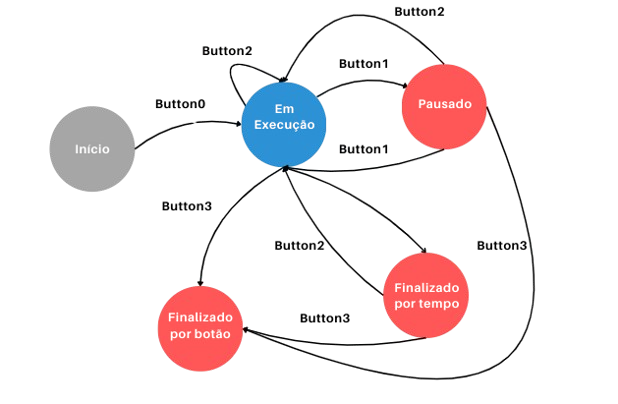

<h1 align="center"> Whack-a-Mole - Jogo 2D</h1>


## Sobre

<p align="justify"> 
</p>

<p align="justify"> 
</p>

<p align="justify"> 
</p>


## Sumário
- [Softwares e Periféricos Utilizados](#softwares-e-periféricos-utilizados)
    - [Kit de desenvolvimento DE1 SoC](#kit-de-desenvolvimento-de1-soc)
    - [Linguagem C](#linguagem-c)
    - [Editor de Texto VSCode](#editor-de-texto-vscode)
    - [Compilador GCC](#compilador-gcc)
    - [Monitor Tubo CRT](#monitor-tubo-crt)
    - [Padrão VGA](#padrão-vga)
    - [Mouse]
    - [Processador Gráfico]

- [Uso de Threads]

- [Implementação do Jogo]
    - Srites novas
    - Colisão 
    - Movimentações (mouse e toupeiras)
    - Pontuação e Temporizador
    - Botões e Display

- [Solução Geral]
- [Cenários de Testes](#cenários-de-testes)
- [Conclusão](#conclusão)
- [Referências](#referências)

## Equipe
- Jeferson Almeida da Silva Ribeiro
- Letícia Teixeira Ribeiro dos Santos
- Vitória Tanan dos Santos

## Softwares e Periféricos Utilizados
### Kit de desenvolvimento DE1-SoC

<p align="justify">
    A placa de desenvolvimento DE1-SoC é uma plataforma baseada no chip Altera Cyclone V SoC, que integra um processador ARM Cortex-A9 dual-core com uma FPGA da família Cyclone V. A DE1-SoC possui uma ampla variedade de periféricos e interfaces, incluindo:
</p>


- Interfaces de entrada/saída;
- Conexões de áudio de vídeo;
- Interface USB;
- Conexões Ethernet;
- LEDS, chaves e botões, entre outros.

<p align="center">
    
    <br>
    Figura 1. Placa de desenvolvimento DE1-SoC.
</p>

### Linguagem C
<p align="justify">
A linguagem C é uma linguagem de programação de alto nível que foi criada nos anos 70 com o propósito inicial de desenvolver sistemas operacionais. Nos dias atuais, ela permanece bastante popular, sendo amplamente utilizada em sistemas embarcados, no Kernel do Linux, aleḿ de também ter servido de influência para criação de outras linguagens como C#, C++ e Java. No projeto, essa linguagem foi utilizada para desenvolver o código fonte em conjunto com o compilador GCC para execução do programa.
</p>

### Editor de Texto VSCode
<p align="justify">
O Visual Studio Code é um editor de texto bastante popular que tem suporte para Windows, Linux e MacOS. Neste projeto, o VSCode foi utilizado para fins de edição do código em linguagem C, usufruindo do realce de sintaxe que o programa propociona.
</p>

### Compilador GCC
<p align="justify"> 
    GCC é sigla para GNU Compiler Collection, trata-se de um conjunto de compiladores para linguagem de programação C, C++, Objective-C, Fortran, Ada, Go, entre outras. Lançado em 1987, é o compilador padrão na maior parte das distribuições Linux além de estar disponível para muitos sistemas embarcados, incluindo chips baseados em ARM e Power ISA. No projeto, foi utilizado para compilar o código fonte escrito em linguagem C.
</p>

### Monitor Tubo CRT
<p align="justify"> 
O monitor utilizado é um modelo de tubo CRT (<i>Cathode Ray Tube</i>) da DELL, com uma tela de 17 polegadas e uma resolução máxima de 1280x1024 <i>pixels</i>. Ele possui uma interface VGA para conectar-se a placa de desenvolvimento DE1-SoC e exibir imagens.
</p>

<p align="center">
    
    <br>
    Figura 2. Monitor Tubo CRT
</p>


### Padrão VGA
<p align="justify"> 
     O padrão gráfico utilizado foi o VGA com resolução de 640x480 pixels. A placa DE1-SoC possui um conector D-SUB de 15 pinos para saída VGA, com sinais de sicronização gerados pelo FPGA Cyclone V Soc. Um DAC de vídeo triplo ADV7123 converte sinais digitais para analógicos, representando as cores vermelho, verde e azul, suportando até a resolução SXGA (1280x1024) a 100 MHz.
    </p>
    <p align="justify"> 
    A sicronização VGA envolve pulsos de sicronização horizontal (<i>hsync</i>) e vertical (<i>vsync</i>), com períodos específicos denominados <i>back porch</i>, <i>front porch</i> e intervalo de exibição para controlar os dados RGB. Após o pulso <i>hsync</i>, os sinais RGB são desligados (<i>back porch</i>), seguidos pelo intervalo de exibição onde os dados RGB ativam cada <i>pixel</i>, e depois desligados novamente (<i>front porch</i>) antes do próximo pulso <i>hsync</i>.
</p>
<p align="center">
    
    <br>
    Figura 3. Conexões entre o FPGA e o VGA
</p>

## Arquitetura e Instruções do Processador Gráfico
<p align="justify"> 
    O Processador Gráfico é responsável pela renderização e execução de um conjunto de instruções que permitem mover e controlar <i>sprites</i>, modificar a configuração do <i>background</i> da tela e renderizar polígonos, como quadrados e triângulos. As saídas do Processador Gráfico incluem os sinais de sicronização horizontal <i>(h_sync)</i> e vertical <i>(v_sync)</i> do monitor VGA, além dos bits de cores RGB <i>(Red, Green, Blue)</i>. A Figura 4 ilustra a arquitetura completa do processador gráfico, conforme detalhado no TCC.
</p>
<p align="center">
    
    <br>
    Figura 4. Estrutura Interna do Processador Gráfico. (Fonte: TCC de [Gabriel B. Alves])
</p>

### Módulo de Desenho
<p align="justify"> 
O Módulo de Desenho gerencia todo o processo de renderização dos <i>pixels</i> no monitor VGA. Ele converte e envia os dados de cor RGB para cada <i>pixel</i>, garantindo a precisão da imagem exibida no monitor. A utilização de uma arquitetura de <i>Pipeline</i> permite ao módulo processar múltiplas instruções ao mesmo tempo, aumentando a eficiência do processamento e previnindo distorções na saída do monitor VGA.
</p>

### Controlador VGA
<p align="justify"> 
O Controlador VGA é responsável por gerar os sinais de sicronização vertical (<i>vsync</i>) e horizontal (<i>hsync</i>), essenciais para a exibição correta dos <i>frames</i> no monitor. Estes sinais são fundamentais para coordenar o processo de varredura do monitor, que ocorre da esquerda para a direita e de cima para baixo. O controlador também fornece as coordenadas X e Y para o processo de varredura, assefurando que cada linha do <i>frame</i> seja renderizada corretamente. Considerando os tempos de sincronização vertical e horizontal, cada tela é atualizada a cada 16,768 ms, resultando em uma taxa de aproximadamente 60 <i>frames</i> por segundo. O módulo coordena ainda a geração dos sinais de sicronização para evitar distorções e garantir que a exibição esteja dentro dos padrões de resolução e taxa de atualização estabelecidos.
</p>

### Memória de Sprites
<p align="justify"> 
A memória de <i>sprites</i> é responsável por armazenar os <i>bitmapes</i> de cada <i>sprite</i>. Ela possui uma capacidade de 12.800 palavras de 9 bits, sendo 3 bits destinados para cada componente de cor RBG. Cada <i>sprite</i> tem um tamanho fixo de 20x20 <i>pixels</i>, ocupando 400 posições de memória. Isso permite que até 32 <i>sprites</i> distintos sejam armazenados simultaneamente para uso. Esta estrutura é essencial para a correta exibição e manipulação dos <i>sprites</i> na tela.
</p>

### Memória de Background
<p align="justify">
A memória de <i>background</i> é usada para modificar pequenas partes do fundo da tela. Ela consiste em 4.800 palavras de 9 bits cada, com 3 bits destinados a cada componente de cor RGB. Esta configuração permite ajustar e atualizar dinamicamente seções específicas do <i>background</i>, garantindo flexibilidade e precisão na exibição gráfica.
</p>


## Threads

<p align="justify">
Para que o jogo funcione de forma satisfatória, é necessário que múltiplos movimentos ocorram independentemente na tela, ou seja, as toupeiras e o martelo devem se mover ao mesmo tempo. Devido a este requisito, duas threads foram implementadas, cada uma responsável pelo movimento de um tipo de elemento do jogo.
<p>

<p align="justify">
As toupeiras são elementos passivos, que significa que não precisam de ação do jogador para se movimentar, enquanto o martelo é um elemento ativo que é controlado pelo jogador. Portanto, a lógica de movimento das toupeiras está em uma thread e a do martelo está em outra.
<p>

<p align="justify">
Para implementar essa funcionalidade, foram utilizadas as funções pthread_create e pthread_join da biblioteca pthread. A função pthread_create é responsável por criar uma nova thread, enquanto pthread_join aguarda a conclusão da thread.
<p>

<p align="justify">

**Thread1 - Movimento do Martelo**

O movimento do martelo, controlado pelo jogador, é gerenciado pela thread1. Esta thread é responsável por detectar os movimentos do mouse e atualizar a posição do martelo na tela em tempo real. Além disso, para garantir que o martelo permaneça dentro dos limites da tela, foi implementada uma limitação do cursor para evitar que o jogador movimente o martelo para uma coordenada inválida.
A contagem de pontuação também está integrada nesta thread. Cada vez que o jogador acerta uma toupeira com o martelo, a pontuação é atualizada.
<p>
<p align="justify">

**Thread2 - Movimento das Toupeiras**

As toupeiras se movem de forma independente do jogador e são gerenciadas pela thread2. Esta thread controla o aparecimento e o desaparecimento das toupeiras de maneira aleatória.
Para garantir a aleatoriedade e o tempo adequado de aparecimento das toupeiras, um temporizador é utilizado nesta thread. Esse temporizador define o intervalo de tempo em que cada toupeira permanece visível antes de desaparecer e reaparecer em outro lugar. A detecção dos botões da placa também faz parte desta thread.
</p>

## Implementação do Jogo
### Movimentações (Mouse e Toupeiras)

**Movimentação do Mouse**
<p align="justify">
O movimento do mouse é capturado a partir do dispositivo /dev/input/mice. As variações no movimento horizontal (x_disp) e vertical (y_disp) são extraídas do buffer do mouse. Com base nesses deslocamentos, as coordenadas x e y do martelo são atualizadas. O martelo se move mais rapidamente conforme a movimentação do mouse, e suas coordenadas são limitadas para permanecer dentro das bordas da tela por meio de uma função que restringe o cursor.
<p>
<p align="justify">
O sprite do martelo é atualizado com as novas coordenadas utilizando a função set_sprite. Quando o botão esquerdo do mouse é pressionado (leftButton), uma verificação é realizada para determinar se o martelo colidiu com alguma toupeira usando a função collision. Se ocorrer uma colisão e a toupeira estiver visível (ou seja, coord_y <= max_y), a pontuação é incrementada.
<p>

**Movimentação das Toupeiras**
<p align="justify">
No jogo, as toupeiras se movem verticalmente dentro de limites definidos por valores máximos (max_y) e mínimos (min_y). Cada toupeira possui um intervalo de movimentação aleatório entre 1 e 3 segundos, determinado pela expressão:

 ``` toupeiras[i]->interval = rand() % 3 + 1 ```.
<p>
<p align="justify">
As toupeiras se movem para cima até atingirem o limite mínimo (min_y). Ao alcançar esse limite, elas invertem a direção e começam a descer. Durante esse tempo, as toupeiras continuam a se mover até atingirem o limite máximo (max_y).
<p>
<p align="justify">
Para controlar a direção das toupeiras, é utilizada uma variável chamada direction. Quando uma toupeira atinge o limite mínimo (min_y), direction é definida como -1, fazendo com que a toupeira desça. Quando a toupeira atinge o limite máximo (max_y), direction é definida como 1, fazendo com que a toupeira suba. 
<p>

### Uso dos botões
<p align="justify">
A placa possui 4 push buttons, todos foram utilizados. Cada função do jogo foi atribuída a um botão, da seguinte forma:

- Botão 0: Iniciar
- Botão 1: Pausar/Despausar
- Botão 2: Reiniciar
- Botão 3: Encerrar
</p>

<p align="justify">
A detecção do pressionamento dos botões se mostrou um desafio pois a função de pausar/despausar estava registrando multiplos cliques sendo que o botão só havia sido pressionado uma vez, impossibilitando que o jogo saísse do estado de Pause. Isso acontece pois a leitura acontece muito rápido e várias vezes antes mesmo que o botão seja liberado. 
</p>
<p align="justify">
Para contornar o problema, foi adicionado um loop verificando se o valor do botão ainda consta como pressionado, se sim, a leitura dos botões é feita novamente até que seja lido como não pressionado, significando que já foi liberado. Essa transição ocorre muito rápido e não trouxe prejuízo para o desempenho do código.
</p>
<p align="justify">
Além dessa técnica, foi empregado também o uso de máscaras de bits para cada um dos botões. Sabe-se que estes possuem lógica invertida, ou seja, possui valor 1 quando não pressionado e 0 quando pressionado. Está disponivel na placa De1SOC um ponteiro KEYS que contém os valores dos 4 botões, portanto as máscaras também possuem 4 bits, como no exemplo:
</p>
<p align="center">
    
    <br>
<p>

<p align="justify">
É mostrado uma operação AND entre o valor do ponteiro KEYS e máscara de bits para o botão 2. Na implementação deste projeto, é verificado se o resultado da operação é igual a 0, o que significa que o botão foi pressionado, qualquer outro valor significa que não foi pressionado. Seguindo o mesmo raciocínio, a máscara para o botão 0 seria 0001 e assim sucessivamente.
</p>
<p align="justify">
Para evitar que qualquer botão altere o estado do jogo a qualquer momento, foi implementada uma máquina de estados. As transições, estados e entradas necessárias para que aconteçam estão detalhadas no diagrama a seguir:
</p>
<p align="center">
    
    <br>
<p>


### Fluxograma da Solução Geral do Projeto


<p align="center">
    
    <br>
    Figura 11. Fluxograma da Solução Geral do Projeto.
</p>


## Execução do Projeto
<p align="justify">
Para que todo o fluxo funcione corretamente, alguns comandos precisam ser executados. A partir da pasta raiz do projeto, executar:

```bash
make
make lib
```
Os comandos irão inserir o módulo no kernel e criar o arquivo especial na pasta /dev. Também irá compilar a biblioteca e o arquivo principal (main). Para mostrar a imagem no monitor, executar:
```bash
sudo ./main
```
</p>


## Cenário de Testes

<p align="justify">
Os cenários de testes foram desenvolvidos para verificar as funções do projeto e se as mesmas estavam se comportando conforme o esperado. Abaixo está cada cenário de teste realizado:
</p>

<p align="justify">
<b>Exibição da cor do background da tela:</b> 

Para configurar a cor de fundo da tela, foi utilizada a função ```set_background_color(int R, int G, int B)```. Essa função escreve no registrado necessário para definir a cor de fundo. No projeto, a cor escolhida foi azul, representando o céu diurno. A figura abaixo exemplifica como ficaria a cor do background no monitor

<p align="center">
    
    <br>
    Figura 13. Exemplo da cor de Background no monitor
</p>

<p align="justify">
<b>Desenho de background blocks:</b> 

O desenho de blocos no background foi realizado utilizando a função ```set_background_block(int endereco_memoria, int R, int G, int B)```. Essa função permite desenhar elementos como a grama e a tartaruga (exceto suas patas) na memória de background. Para facilitar o processo, um laço ```for``` foi utilizado para definir as áreas na memória onde esses blocos deveriam ser desenhados. A Figura 14 mostra um exemplo de como deveria ficar o desenho usando os background blocks.

<p align="center">
    
    <br>
    Figura 14. Exemplo do desenho utilizando apenas os blocos
<p>


<p align="justify">
<b>Configuração de sprites:</b> 

A função ```set_sprite(int reg, int x, int y, int offset, int activation_bit)``` foi empregada para configurar e exibir sprites na tela. A Figura 16 demonstra um exemplo final do desenho com sprites.

<p align="center">
    
    <br>
    Figura 16. Exemplo desenho final com os sprites
</p>

## Conclusão

<p align="justify">
O objetivo deste projeto foi estabelecer uma comunicação eficiente entre o HPS e o Processador Gráfico. Os resultados alcançados foram satisfatórios, especialmente na geração de uma imagem estática. No entanto, para avançar em direção à geração de imagens dinâmicas, é necessário realizar estudos adicionais e desenvolver projetos futuros.
</p>

<p align="justify">
Dentro do escopo proposto, foi possível efetuar a comunicação entre o software e o hardware utilizando barramentos. Isso demonstra a viabilidade e a funcionalidade da interface de comunicação.
</p>

<p align="justify">
Em conclusão, o projeto mostrou que a comunicação entre o HPS e o Processador Gráfico é viável e eficaz para a geração de imagens estáticas. O próximo passo será aprofundar os estudos e os desenvolvimentos necessários para alcançar a geração de imagens dinâmicas.
</p>

## Referências

<b>Character device drivers — The Linux Kernel documentation</b>. Disponível em: <https://linux-kernel-labs.github.io/refs/heads/master/labs/device_drivers.html>.

<b>Memory mapping — The Linux Kernel documentation</b>. Disponível em: <https://linux-kernel-labs.github.io/refs/heads/master/labs/memory_mapping.html>.

<b>Technologies, Terasic. DE1-SoC User Manual</b>. Disponível em: <http://www.ee.ic.ac.uk/pcheung/teaching/ee2_digital/de1-soc_user_manual.pdf.>


SÁ BARRETO, Gabriel. <b>Desenvolvimento de uma Arquitetura Baseada em Sprites para criação de Jogos 2D em Ambientes Reconfiguráveis utilizando dispositivos FPGA</b>. s.d. 14 f. Trabalho de Conclusão de Curso (Graduação em Engenharia de Computação) Universidade Estadual de Feira de Santana, Bahia.

<b>Lab 1: Acessando dispositivos de Hardware da FPGA</b>. Bahia: Universidade Estadual de Feira de Santana, 2024
