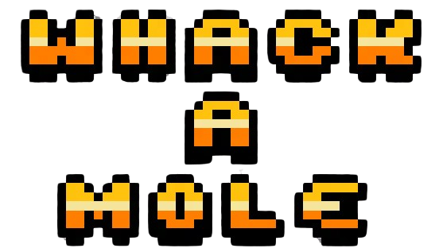
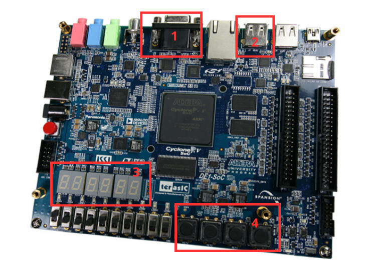
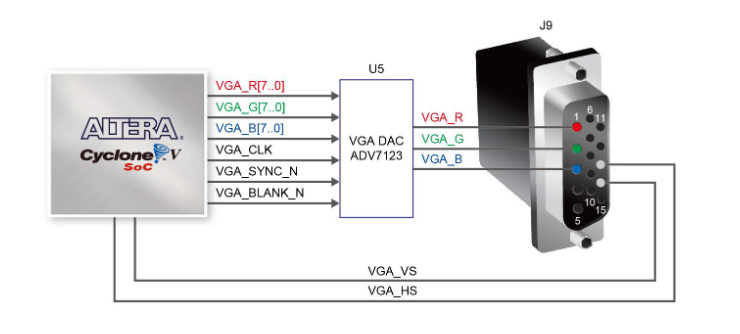
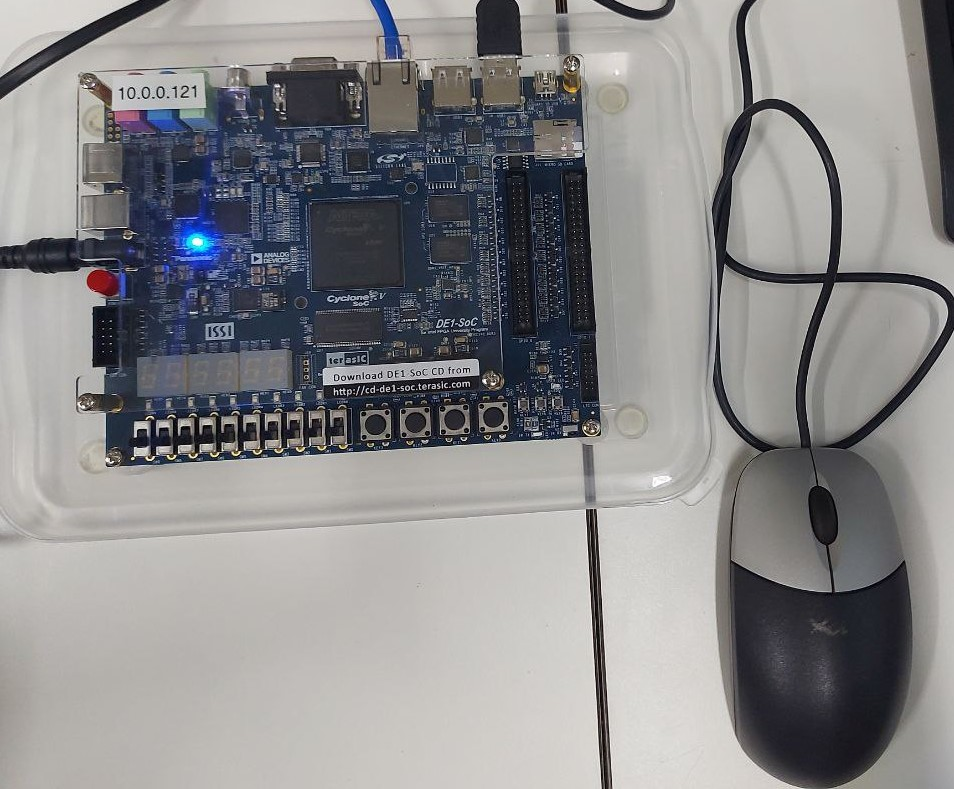
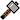
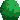
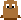
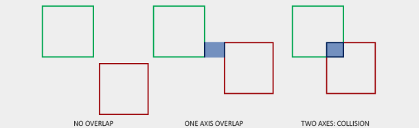
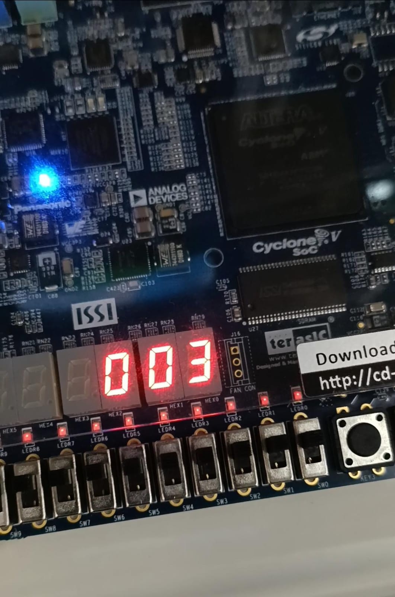

<p align="center">
    
    <br>

</p>

## Sobre

<p align="justify"> 
O objetivo central deste projeto foi desenvolver um jogo para a arquitetura criada anteriormente no <a href="https://github.com/vitoriatanan/Processador-Grafico/tree/main?tab=readme-ov-file#sobre">projeto de comunicação com o processador gráfico</a>.
<p>

<p align="justify">
Inspirado em um clássico arcade, o jogo simula o desafio de acertar o maior número possível de toupeiras que surgem aleatoriamente acima de arbustos na tela. O jogador deve usar um martelo controlado pelo mouse para acertar as toupeiras e acumular pontos dentro de um limite de tempo de 1 minuto.
<p>

<p align="justify">
O jogo foi projetado para permitir a interação do usuário exclusivamente através do mouse, que serve como um dos principais meios de controle. Para permitir o controle das diversas funcionalidades do jogo como iniciar, pausar, retornar e encerrar, foi necessário mapear e programar os botões da placa DE1-SoC. Além disso, foi implementado o uso de displays de 7 segmentos para fornecer informações ao usuário.
</p>

<p align="justify"> 
A plataforma DE1-SoC combina um processador ARM (HPS) com um processador gráfico integrado na FPGA, possibilitando uma comunicação eficiente entre esses dois componentes. Essa integração permite o controle e a manipulação visual através de um monitor VGA com resolução de 640×480 pixels.
</p>

<p align="justify"> 
Além disso, o projeto envolveu a otimização do módulo de Kernel Linux e da biblioteca em linguagem C para estabelecer uma ponte de comunicação mais eficiente entre o processador gráfico na FPGA e o programa a nível de usuário, para que fosse possível realizar com êxito a construção do projeto atual.
</p>


## Sumário
- [Softwares e Periféricos Utilizados](#softwares-e-periféricos-utilizados)
    - [Kit de desenvolvimento DE1 SoC](#kit-de-desenvolvimento-de1-soc)
    - [Linguagem C](#linguagem-c)
    - [Editor de Texto VSCode](#editor-de-texto-vscode)
    - [Compilador GCC](#compilador-gcc)
    - [Monitor Tubo CRT](#monitor-tubo-crt)
    - [Padrão VGA](#padrão-vga)
    - [Mouse](#mouse)
    - [Processador Gráfico](#processador-gráfico)
    - [Módulo de Kernel](#modulo-de-kernel)
- [Threads](#threads)
- [Implementação do Jogo](#implementação-do-jogo)
    - [Sprites Novos e Telas do Jogo](#sprites-novos-e-telas-do-jogo)
    - [Colisão](#colisão)
    - [Movimentações)](#movimentações)
    - [Uso dos Botões](#uso-dos-botões)
    - [Display 7 Segmentos](#display-7-segmentos)
    - [Temporizador](#temporizador)
    - [Regras e Jogabilidade](#regras-e-jogabilidade)
- [Fluxograma da Solução Geral do Projeto](#fluxograma-da-solução-geral-do-projeto)
- [Cenários de Testes](#cenários-de-testes)
- [Resultado Final](#resultado-final)
- [Conclusão](#conclusão)
- [Referências](#referências)

## Equipe
- Jeferson Almeida da Silva Ribeiro
- Letícia Teixeira Ribeiro dos Santos
- Vitória Tanan dos Santos

## Softwares e Periféricos Utilizados
### Kit de desenvolvimento DE1-SoC

<p align="justify">
    A placa de desenvolvimento DE1-SoC é uma plataforma baseada no chip Altera Cyclone V SoC, que integra um processador ARM Cortex-A9 dual-core com uma FPGA da família Cyclone V. A DE1-SoC possui uma ampla variedade de periféricos e interfaces. Os periféricos utilizados nesse projeto foram os que estão numerados na imagem:
</p>

<p align="center">
    
    <br>
    Figura 1. Placa de desenvolvimento DE1-SoC.
</p>


1. <a href="https://github.com/leticiaribeiro7/whack-a-mole?tab=readme-ov-file#padr%C3%A3o-vga">Padrão VGA</a>
2. <a href="https://github.com/leticiaribeiro7/whack-a-mole?tab=readme-ov-file#mouse">Entrada USB para conectar o mouse</a>
3. <a href="https://github.com/leticiaribeiro7/whack-a-mole?tab=readme-ov-file#display-7-segmentos">Display 7 segmentos para mostrar pontuação</a>
4. <a href="https://github.com/leticiaribeiro7/whack-a-mole?tab=readme-ov-file#uso-dos-bot%C3%B5es">Push buttons para funcionalidades do jogo</a>

### Linguagem C
<p align="justify">
A linguagem C é uma linguagem de programação de alto nível que foi criada nos anos 70 com o propósito inicial de desenvolver sistemas operacionais. Nos dias atuais, ela permanece bastante popular, sendo amplamente utilizada em sistemas embarcados, no Kernel do Linux, aleḿ de também ter servido de influência para criação de outras linguagens como C#, C++ e Java. No projeto, essa linguagem foi utilizada para desenvolver o código fonte em conjunto com o compilador GCC para execução do programa.
</p>

### Editor de Texto VSCode
<p align="justify">
O Visual Studio Code é um editor de texto bastante popular que tem suporte para Windows, Linux e MacOS. Neste projeto, o VSCode foi utilizado para fins de edição do código em linguagem C, usufruindo do realce de sintaxe que o programa propociona.
</p>

### Compilador GCC
<p align="justify"> 
    GCC é sigla para GNU Compiler Collection, trata-se de um conjunto de compiladores para linguagem de programação C, C++, Objective-C, Fortran, Ada, Go, entre outras. Lançado em 1987, é o compilador padrão na maior parte das distribuições Linux além de estar disponível para muitos sistemas embarcados, incluindo chips baseados em ARM e Power ISA. No projeto, foi utilizado para compilar o código fonte escrito em linguagem C.
</p>

### Monitor Tubo CRT
<p align="justify"> 
O monitor utilizado é um modelo de tubo CRT (<i>Cathode Ray Tube</i>) da DELL, com uma tela de 17 polegadas e uma resolução máxima de 1280x1024 <i>pixels</i>. Ele possui uma interface VGA para conectar-se a placa de desenvolvimento DE1-SoC e exibir imagens.
</p>

<p align="center">
    
    <br>
    Figura 2. Monitor Tubo CRT
</p>


### Padrão VGA
<p align="justify"> 
     O padrão gráfico utilizado foi o VGA com resolução de 640x480 pixels. A placa DE1-SoC possui um conector D-SUB de 15 pinos para saída VGA, com sinais de sicronização gerados pelo FPGA Cyclone V Soc. Um DAC de vídeo triplo ADV7123 converte sinais digitais para analógicos, representando as cores vermelho, verde e azul, suportando até a resolução SXGA (1280x1024) a 100 MHz.
    </p>
    <p align="justify"> 
    A sicronização VGA envolve pulsos de sicronização horizontal (<i>hsync</i>) e vertical (<i>vsync</i>), com períodos específicos denominados <i>back porch</i>, <i>front porch</i> e intervalo de exibição para controlar os dados RGB. Após o pulso <i>hsync</i>, os sinais RGB são desligados (<i>back porch</i>), seguidos pelo intervalo de exibição onde os dados RGB ativam cada <i>pixel</i>, e depois desligados novamente (<i>front porch</i>) antes do próximo pulso <i>hsync</i>.
</p>
<p align="center">
    
    <br>
    Figura 3. Conexões entre o FPGA e o VGA
</p>

### Mouse
<p align="justify">
    Um mouse é utilizado como dispositivo de entrada para interagir com as toupeiras que aparecem aleatoriamente na tela. O botão esquerdo do mouse é usado para acertar as toupeiras, acumulando pontos a cada acerto bem-sucedido e o movimento do mouse controla a posição de um martelo na tela, permitindo ao jogador responder rapidamente às ações do jogo. O mouse está conectado à placa por meio de uma porta USB e a lógica do funcionamento do mouse é gerenciada por uma thread.
</p>
<p align="center">
    
    <br>
    Figura 4. Mouse conectado a placa de desenvolvimento DE1-Soc.
</p>

### Processador Gráfico
<p align="justify"> 
    O Processador Gráfico está embarcado na FPGA da placa e é responsável pela renderização e execução de um conjunto de instruções que permitem mover e controlar <i>sprites</i>, modificar a configuração do <i>background</i> da tela e renderizar polígonos, como quadrados e triângulos. As saídas do Processador Gráfico incluem os sinais de sicronização horizontal <i>(h_sync)</i> e vertical <i>(v_sync)</i> do monitor VGA, além dos bits de cores RGB <i>(Red, Green, Blue)</i>. A Figura 4 ilustra a arquitetura completa do processador gráfico, conforme detalhado no TCC.
</p>
<p align="center">
    
    <br>
    Figura 4. Estrutura Interna do Processador Gráfico. (Fonte: TCC de [Gabriel B. Alves])
</p>

### Módulo de Kernel

<p align="justify"> 
Sabendo que a comunicação com hardware requer tipos de dados específicos a fim de evitar resultados inesperados, algumas mudanças foram efetuadas no módulo de kernel:
</p>

**Alteração do tipo de ponteiro LW_Virtual para __iomem**
<p align="justify"> 
Este ponteiro é o Lightweight HPS-to-FPGA, que funciona como uma ponte para acesso aos componentes da FPGA e é usado no mapeamento de memória física para virtual.
</p>

Exemplo de uso:
```
data_a_ptr = (volatile int*)(LW_virtual + DATA_A_BASE); // Acesso ao barramento Data A do processador gráfico
```

Como os componentes são de I/O, o tipo **___iomem_** é mais adequado, pois se trata de um tipo que referencia uma região de memória de entrada/saída.


**Alteração do tipo dos ponteiros dos barramentos DataA e DataB para u32**

<p align="justify"> 
Os barramentos tem 32 bits cada, e o uso do tipo u32 (unsigned int 32 bits) é adequado, para que os dados enviados para os barramentos tenham o tamanho exato.
</p>

**Uso da função _iowrite32_**

É comumente usada no desenvolvimento de drivers no kernel do Linux para escrever um valor de 32 bits em um endereço de memória de I/O mapeada, garantindo que a comunicação seja eficiente e correta.


## Threads
#### Contextualização 
<p align="justify">
Threads são unidades básicas de execução que um processo pode dividir para realizar múltiplas tarefas simultaneamente. Eles permitem a execução concorrente dentro de um único processo. 
Uma vantagem de usá-las é aumentar a eficiência do programa, especialmente em operações de I/O ou em processadores multicore. Por outro lado, podem ocorrer resultados inesperados devido à condições de corrida: 
quando duas threads ou mais acessam e modificam dados compartilhados simultaneamente.
</p>

#### Aplicação
<p align="justify">
Para que o jogo funcione de forma satisfatória, é necessário que múltiplos movimentos ocorram independentemente na tela, ou seja, as toupeiras e o martelo devem se mover ao mesmo tempo. Devido a este requisito, duas threads foram implementadas, cada uma responsável pelo movimento de um tipo de elemento do jogo.
<p>


<p align="justify">
As toupeiras são elementos passivos, que significa que não precisam de ação do jogador para se movimentar, enquanto o martelo é um elemento ativo que é controlado pelo jogador. Portanto, a lógica de movimento das toupeiras está em uma thread e a do martelo está em outra.
<p>

<p align="justify">
Para implementar essa funcionalidade, foram utilizadas as funções pthread_create e pthread_join da biblioteca pthread. A função pthread_create é responsável por criar uma nova thread, enquanto pthread_join aguarda a conclusão da thread.
<p>

**pthread_create:**
<p align="justify">
A sintaxe da função para criar uma nova thread é:

```c
int pthread_create(pthread_t *thread, const pthread_attr_t *attr, void *(*start_routine)(void*), void *arg);
```
<p>

<p align="justify">

+ ***thread**: Ponteiro para uma variável do tipo pthread_t onde o identificador da nova thread será armazenado.
<p>

<p align="justify">

+ ***attr**: Ponteiro para um objeto pthread_attr_t que especifica os atributos da thread. Se NULL, a thread é criada com atributos padrão.
<p>

<p align="justify">

+ **start_routine**: Função que a thread executará. Deve aceitar um argumento do tipo void* e retornar um valor do tipo void*.
<p>

<p align="justify">

+ **arg**: Argumento passado para a função start_routine.
<p>

<p align="justify">
No contexto do projeto, a criação de uma nova thread é feita da seguinte maneira:
<p>

```c
if (pthread_create(&thread1, NULL, movimentoToupeira, (void*)args) != 0) {
    perror("Failed to create thread 1");
    return 1;
}
```
<p align="justify">
Nesse trecho de código, thread1 é o identificador da nova thread, NULL indica que a thread será criada com atributos padrão, movimentoToupeira é a função que a thread executará e args é o argumento passado para essa função. Um processo similar é utilizado para criar thread2.
<p>

**pthread_join:**

<p align="justify">
A Sintaxe utilizada para thread que espera que uma thread termine sua execução é:
<p>

```c
int pthread_join(pthread_t thread, void **value_ptr);
```
<p align="justify">

+ **thread**: Identificador da thread que se deseja esperar.
<p>

<p align="justify">

+ **value_ptr**: Se não for NULL, é usado para armazenar o valor retornado pela função da thread.
<p>

<p align="justify">
No contexto do projeto, pthread_join é utilizado da seguinte maneira:
<p>

```c
if (pthread_join(thread1, NULL) != 0) {
    perror("Failed to join thread 1");
    return 1;
    }
```
<p align="justify">
Isso garante que o processo principal aguardará a conclusão da thread1. O mesmo procedimento é aplicado para thread2.
<p>

**Thread1 - Movimento do Martelo**

<p align="justify">
O movimento do martelo, controlado pelo jogador, é gerenciado pela thread1. Esta thread é responsável por detectar os movimentos do mouse e atualizar a posição do martelo na tela em tempo real. 

Além disso, para garantir que o martelo permaneça dentro dos limites da tela, foi implementada uma limitação do cursor para evitar que o jogador movimente o martelo para uma coordenada inválida. 

A contagem de pontuação também está integrada nesta thread. Cada vez que o jogador acerta uma toupeira com o martelo, a pontuação é atualizada. Manter a lógica de pontuação na thread1 foi necessária para garantir garantir que a contagem e a exibição da pontuação não fossem atrasadas por outras operações do jogo.
<p>

**Thread2 - Movimento das Toupeiras**
<p align="justify">
As toupeiras se movem de forma independente do jogador e são gerenciadas pela thread2. Esta thread controla o aparecimento e o desaparecimento das toupeiras de maneira aleatória. 

Para garantir a aleatoriedade e o tempo adequado de aparecimento das toupeiras, um temporizador é utilizado nesta thread. A implementação do temporizador nessa thread se deu para garantir que não haja atrasos por outras operações do jogo. Esse temporizador define o intervalo de tempo em que cada toupeira permanece visível antes de desaparecer e reaparecer em outro lugar. 

A detecção dos botões da placa também faz parte desta thread para garantir que a interface do usuário responda rapidamente às interações do jogador.
</p>

## Implementação do Jogo

### Sprites Novos e Telas do Jogo
<p align="justify">
Para o desenvolvimento do jogo, foram criados três sprites na memória: martelo, arbusto e toupeira. Foi utilizada a ferramenta <a href="https://www.pixilart.com">Pixilart</a> para desenhar cada sprite com uma dimensão de 20x20 pixels, criando-os pixel a pixel. Após o desenho ser finalizado, as imagens foram salvas no formato adequado.

</p>
<p align="justify">
Para o processamento das imagens, foi utilizada a biblioteca <a href="https://python-pillow.org">Pillow</a>, que é amplamente usada para abrir e manipular imagens em Python. Esta biblioteca nos permitiu extrair a matriz de valores RGB de cada pixel das imagens salvas. Em seguida, esses dados foram convertidos para a linguagem C, permitindo a integração dos sprites na lógica do jogo.
</p>

- Sprites criados:
<p align="center">
    
    <br>
   Figura X. Sprite de martelo
    
</p>

<p align="center">
    
    <br>
   Figura X. Sprite de arbusto
    
</p>

<p align="center">
    
    <br>
   Figura X. Sprite de toupeira
</p>

<p align="justify">
As telas do jogo (vide seção <a href="https://github.com/leticiaribeiro7/whack-a-mole/blob/main/README.md#cen%C3%A1rios-de-testes">Cenários de Teste</a>) também foram feitas com a mesma abordagem dos sprites, porém os desenhos foram feitos em tamanho 80x60, dado que o monitor com VGA possui 640x480 pixels e cada bloco personalizável do processador gráfico tem tamanho 8x8. O código em Python está preparado para receber qualquer tamanho de imagem, basta passar por parâmetro a largura e a altura desejada.
</p>

### Colisão
<p align="justify">
    A colisão é um princípio básico nos jogos, neste contexto foi necessário saber quando o martelo colide com a toupeira. Para implementar isso, foi usado um conceito chamado Axis-Aligned Bounding Box (Caixa Delimitadora Alinhada aos Eixos), uma forma de colisão retangular alinhada aos eixos base da cena, que em 2D se alinha aos eixos x e y. Estar alinhada aos eixos significa que a caixa retangular não possui rotação e suas bordas são paralelas aos eixos base da cena (por exemplo, as bordas esquerda e direita são paralelas ao eixo y). O fato dessas caixas estarem sempre alinhadas aos eixos da cena facilita os cálculos.
</p>
<p align="justify">
    Uma colisão ocorre quando dois elementos entram nas regiões um do outro, é determinado se o primeiro objeto está de alguma forma dentro do espaço do segundo objeto (nesse caso, ambos os objetos tem tamanho 20x20). Essa verificação ocorre analisando se as bordas horizontais e as bordas verticais dos dois objetos se sobrepõem, se sim, ocorreu uma colisão.
</p>

<p align="center">
    
    <br>
   Figura X. Exemplo de colisão de quadrados na terceira figura
    
</p>

### Movimentações

**Movimentação do Mouse**
<p align="justify">
O movimento do mouse é capturado a partir do dispositivo /dev/input/mice. As variações no movimento horizontal (x_disp) e vertical (y_disp) são extraídas do buffer do mouse. Com base nesses deslocamentos, as coordenadas x e y do martelo são atualizadas. O martelo se move mais rapidamente conforme a movimentação do mouse, e suas coordenadas são limitadas para permanecer dentro das bordas da tela por meio de uma função que restringe o cursor.
<p>
<p align="justify">
O sprite do martelo é atualizado com as novas coordenadas utilizando a função set_sprite. Quando o botão esquerdo do mouse é pressionado (leftButton), uma verificação é realizada para determinar se o martelo colidiu com alguma toupeira usando a função collision. Se ocorrer uma colisão e a toupeira estiver visível (ou seja, coord_y <= max_y), a pontuação é incrementada.
<p>

**Movimentação das Toupeiras**
<p align="justify">
No jogo, as toupeiras se movem verticalmente dentro de limites definidos por valores máximos (max_y) e mínimos (min_y). Cada toupeira possui um intervalo de movimentação aleatório entre 1 e 3 segundos, determinado pela expressão:

``` toupeiras[i]->interval = rand() % 3 + 1 ```.
<p>
<p align="justify">
As toupeiras se movem para cima até atingirem o limite mínimo (min_y). Ao alcançar esse limite, elas invertem a direção e começam a descer. Durante esse tempo, as toupeiras continuam a se mover até atingirem o limite máximo (max_y).
<p>
<p align="justify">
Para controlar a direção das toupeiras, é utilizada uma variável chamada direction. Quando uma toupeira atinge o limite mínimo (min_y), direction é definida como -1, fazendo com que a toupeira desça. Quando a toupeira atinge o limite máximo (max_y), direction é definida como 1, fazendo com que a toupeira suba. 
<p>

### Uso dos botões
<p align="justify">
A placa possui 4 push buttons, todos foram utilizados. Cada função do jogo foi atribuída a um botão, da seguinte forma:

- Botão 0: Iniciar
- Botão 1: Pausar/Despausar
- Botão 2: Reiniciar
- Botão 3: Encerrar
</p>

<p align="justify">
A detecção do pressionamento dos botões se mostrou um desafio pois a função de pausar/despausar estava registrando multiplos cliques sendo que o botão só havia sido pressionado uma vez, impossibilitando que o jogo saísse do estado de Pause. Isso acontece pois a leitura acontece muito rápido e várias vezes antes mesmo que o botão seja liberado. 
</p>
<p align="justify">
Para contornar o problema, foi adicionado um loop verificando se o valor do botão ainda consta como pressionado, se sim, a leitura dos botões é feita novamente até que seja lido como não pressionado, significando que já foi liberado. Essa transição ocorre muito rápido e não trouxe prejuízo para o desempenho do código.
</p>
<p align="justify">
Além dessa técnica, foi empregado também o uso de máscaras de bits para cada um dos botões. Sabe-se que estes possuem lógica invertida, ou seja, possui valor 1 quando não pressionado e 0 quando pressionado. Está disponivel na placa De1SOC um ponteiro KEYS que contém os valores dos 4 botões, portanto as máscaras também possuem 4 bits, como no exemplo:
</p>
<p align="center">
    
    <br>
<p>

<p align="justify">
É mostrado uma operação AND entre o valor do ponteiro KEYS e máscara de bits para o botão 2. Na implementação deste projeto, é verificado se o resultado da operação é igual a 0, o que significa que o botão foi pressionado, qualquer outro valor significa que não foi pressionado. Seguindo o mesmo raciocínio, a máscara para o botão 0 seria 0001 e assim sucessivamente.
</p>
<p align="justify">
Para evitar que qualquer botão altere o estado do jogo a qualquer momento, foi implementada uma máquina de estados. As transições, estados e entradas necessárias para que aconteçam estão detalhadas no diagrama a seguir:
</p>
<p align="center">
    
    <br>
<p>

### Display 7 Segmentos
<p align="justify">
A pontuação do jogo é mostrada no display de 7 segmentos, dos 6 dígitos disponíveis foram usados 3 para contar até a casa das centenas, devido ao tempo do jogo ser limitado. Foi usado um ponteiro para cada dígito do display, portanto a pontuação precisou ser isolada em dígitos separados, essa lógica foi implementada utilizando divisões e resto de divisões:

```c
    int dezena = pontuacao / 10;
    int unidade = pontuacao % 10;
    int centena = (pontuacao / 100) % 10;
```


Para mostrar dígitos decimais e acender os segmentos certos, foi utilizado um array para mapear o correspondente binário dos números de 0 a 9 e uma função para pegar esses valores do array e passar para o ponteiro:

```c
    uint8_t display(int number) {
        return segmentos[number];
    }

    *HEX0_ptr = display(unidade);
    *HEX1_ptr = display(dezena);
    *HEX2_ptr = display(centena);

```
Exemplo: entrada do array segmentos **0b1000000** => corresponde ao número 0, apenas 1 segmento está apagado (o display possui lógica invertida).

</p>

### Temporizador
<p align="justify">
A duração de uma partida do jogo é 60 segundos e a cada 5 segundos uma parte da barra de tempo desaparece, para que isso seja possível é preciso contar o tempo de execução do programa. Para isso, foi utilizada a biblioteca time.h e a função time(); ao salvar o valor de retorno dessa função em diferentes partes do código e depois subtrair, é possível obter o tempo que se passou em segundos entre uma e outra, essa foi a abordagem utilizada.

```current_time - start_time >= 60```

</p>

### Regras e Jogabilidade
<p align="justify">
    O jogador deve acertar o máximo de toupeiras possível dentro do limite de tempo a fim de aumentar a pontuação, o mouse deve ser utilizado para movimentar na tela e o botão esquerdo para efetivar a jogada. Há algumas condições para que os pontos sejam contabilizados, são elas:
</p>

1. O jogo não pode estar em estado de Pause
2. A toupeira deve estar fora do arbusto
3. Deve ocorrer colisão entre o martelo e a toupeira
4. Deve ocorrer clique com o botão esquerdo do mouse


### Fluxograma da Solução Geral do Projeto

<p align="center">
    
    <br>
    Figura 11. Fluxograma da Solução Geral do Projeto.
</p>


## Execução do Projeto
<p align="justify">
Para que todo o fluxo funcione corretamente, alguns comandos precisam ser executados. A partir da pasta raiz do projeto, executar:

```bash
make
make lib
```
O comando **make** irá inserir o módulo do processador gráfico no kernel e criar o arquivo especial na pasta /dev. O **make lib** irá compilar a biblioteca e os arquivos principal e secundários. Para iniciar o jogo no monitor, executar:
```bash
sudo ./main
```
</p>


## Cenários de Testes

<p align="justify">
Os cenários de testes foram desenvolvidos para verificar as funções do projeto e se as mesmas estavam se comportando conforme o esperado. Abaixo está cada cenário de teste realizado:
</p>

- Quando o programa é compilado, ele inicia na tela inicial do jogo.

<p align="center">
    
    <br>
    Figura X. Tela inicial
    
- Ao pressionar o botão KEY0 na placa, a tela inicial deve ser substituída pela tela do jogo.

<p align="center">
    
    <br>
    Figura X. Tela do jogo
</p>

- Ao pressionar o botão KEY1 na placa durante o jogo, o jogo é pausado. Pressionando novamente, o jogo é retomado, voltando à jogabilidade normal.
<p align="center">
    
    <br>
    Figura X. Tela do jogo pausado
</p>

- Ao pressionar o botão KEY2 na placa durante o jogo, o jogo reinicia.
<p align="center">
    
    <br>
    Figura X. Tela do jogo ao reiniciar
</p>

- Quando o tempo de 60 segundos se esgota durante o jogo, a tela do jogo é substituída pela tela de game over.

<p align="center">
    
    <br>
    Figura X. Tela de game over
</p>

- Ao clicar com o botão esquerdo do mouse nas toupeiras que aparecem durante o jogo, os pontos são atualizados no display de 7 segmentos.

<p align="center">
    
    <br>
    Figura X. Pontuação no display 7 segmentos
</p>


## Resultado Final
O GIF demonstra a versão do jogo "Whack-a-Mole", onde o cursor do mouse atua como um martelo para acertar as toupeiras que aparecem aleatoriamente nos arbustos.
<p align="center">
    
    <br>
    GIF. Jogabilidade
</p>

## Conclusão
<p align="justify">
O objetivo deste projeto foi desenvolver um jogo para uma arquitetura já existente. Os resultados obtidos foram satisfatórios, abrangendo tanto a geração de imagens estáticas quanto dinâmicas.
</p>

<p align="justify">
Dentro do proposto, foi possível realizar a interação entre o usuario e o jogo por meio do mouse e do botões da placa. Isso demonstra a viabilidade e funcionalidade da arquitetura desenvolvida no projeto de comunicação com o processador gráfico.
</p>

<p align="justify">
Em conclusão, o projeto demonstrou que a comunicação entre o HPS e o Processador Gráfico é viável e eficaz para a geração de imagens estáticas e imagens dinamicas. 
</p>

## Referências

Processador Gráfico: projeto para comunicação entre processador gráfico e processador ARM. GitHub, 2024. Disponível em: <https://github.com/vitoriatanan/Processador-Grafico/tree/main?tab=readme-ov-file#sobre>.
<b>Character device drivers — The Linux Kernel documentation</b>. Disponível em: <https://linux-kernel-labs.github.io/refs/heads/master/labs/device_drivers.html>.

<b>Memory mapping — The Linux Kernel documentation</b>. Disponível em: <https://linux-kernel-labs.github.io/refs/heads/master/labs/memory_mapping.html>.

<b>Technologies, Terasic. DE1-SoC User Manual</b>. Disponível em: <http://www.ee.ic.ac.uk/pcheung/teaching/ee2_digital/de1-soc_user_manual.pdf.>


SÁ BARRETO, Gabriel. <b>Desenvolvimento de uma Arquitetura Baseada em Sprites para criação de Jogos 2D em Ambientes Reconfiguráveis utilizando dispositivos FPGA</b>. s.d. 14 f. Trabalho de Conclusão de Curso (Graduação em Engenharia de Computação) Universidade Estadual de Feira de Santana, Bahia.

<b>Lab 1: Acessando dispositivos de Hardware da FPGA</b>. Bahia: Universidade Estadual de Feira de Santana, 2024
